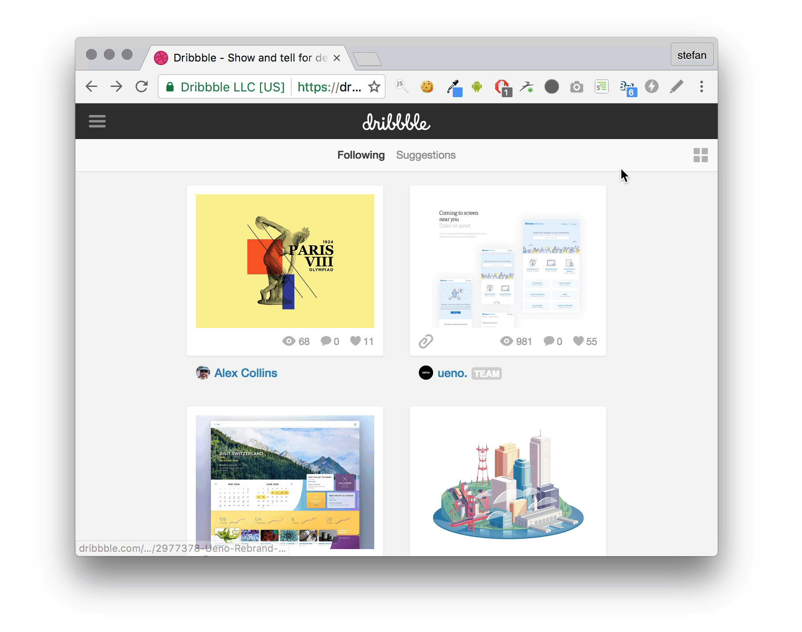

# DesignMode - Chrome Extension

## How does this work?

Found in the [spec](https://html.spec.whatwg.org/multipage/interaction.html#making-entire-documents-editable:-the-designmode-idl-attribute):

> Documents have a designMode, which can be either enabled or disabled.

By running `document.designMode = 'on'` in the JavaScript console websites become magically editable.

Sounds cool? It is! Give a try.